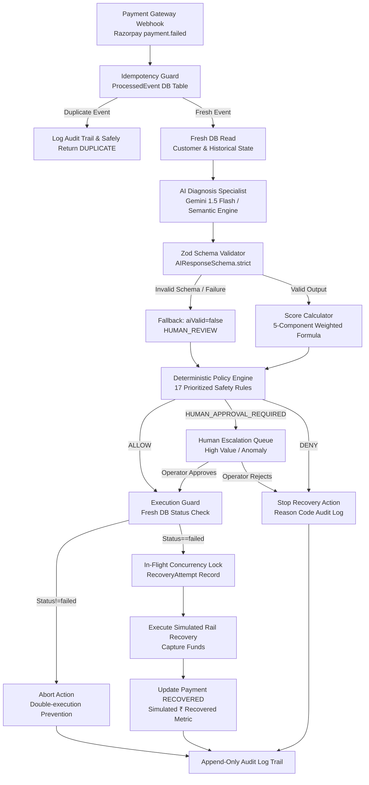

# RecoverAI — System Architecture & Technical Specification

> **AI recommends. Deterministic policy disposes.**
> The AI never controls money movement or executes side effects directly.

---

## 1. High-Level System Architecture



---

## 2. Core Operational Loop: 7-Step Lifecycle

1. **DETECT**: Inbound gateway webhook ingested and deduplicated via `ProcessedEvent` table using `(merchant_id, gateway_event_id)` unique constraint.
2. **DIAGNOSE**: Payment error code, decline reason, payment method rail, and historical context analyzed by AI Diagnostic Specialist. Outputs strictly validated `AIResponse`.
3. **DECIDE**: 
   - Multi-factor Recovery Score computed via frozen V1 formula.
   - Deterministic Policy Engine evaluates all 17 prioritized safety rules.
4. **RECOVER**: If `ALLOW`, server-side Execution Guard verifies fresh DB state and locks in-flight recovery attempt before executing action.
5. **STOP**: Stopping rules immediately halt execution if fraud is suspected, customer is blocked, retry limit (3) is reached, cooldown (30m) is active, or event is stale (> 180m).
6. **MEASURE**: Simulated revenue recovered (₹) and recovery success rate tracked in real time.
7. **AUDIT**: Complete chronological audit trail logged for every state transition, operator action, and automated decision.

---

## 3. The Strict Separation Boundary

| Layer | Responsibility | What it CANNOT do |
|---|---|---|
| **AI Diagnosis Engine** | Classifies failure semantics, assesses confidence, provides human explanations | CANNOT touch money, CANNOT mutate payments, CANNOT trigger webhooks |
| **Score Calculator** | Pure mathematical weighted combination of 5 factors | Has no side effects |
| **Deterministic Policy Engine** | Pure decision rules evaluated in strict priority order | Enforces compliance boundaries |
| **Execution Guard** | Server-controlled fresh DB read keyed by `transactionId` | Never accepts AIResponse as an input parameter |
| **Action Executor** | Executes gateway retry simulation and updates persistent state | Strictly requires `ALLOW` from policy engine |

---

## 4. Weighted Recovery Scoring Formula

```
Recovery Score = round(
    0.35 * FailureReason +
    0.20 * RetryScore +
    0.15 * RecencyScore +
    0.20 * HistoryScore +
    0.10 * ConfidenceScore
)
```

- **Failure Reason Score (35%)**:
  - `NETWORK_ERROR`: 95
  - `INSUFFICIENT_FUNDS`: 75
  - `BANK_DECLINED_GENERIC`: 60
  - `AUTH_FAILURE`: 45
  - `UNKNOWN`: 30
  - `EXPIRED_CARD`: 20
  - `FRAUD_SUSPECTED`: 0
- **Retry Count Score (20%)**: 0 retries = 100, 1 retry = 70, 2 retries = 35, ≥ 3 retries = 0.
- **Event Recency Score (15%)**: ≤ 5 min = 100, ≤ 30 min = 85, ≤ 60 min = 65, ≤ 180 min = 35, > 180 min = 0.
- **Customer History Score (20%)**: Success rate percentage based on prior payment history. Blocked/flagged customer = 0.
- **AI Confidence Score (10%)**: `confidence * 100` if AI response is valid, 0 if invalid.
- **Rounding**: Exactly one final `Math.round()` call.

---

## 5. Deterministic Policy Catalog (17 Prioritized Safety Rules)

| Priority | Rule Name | Condition | Decision | Action |
|:---:|---|---|:---:|:---:|
| 1 | `AUTOMATION_DISABLED` | Merchant disabled automated recovery | `DENY` | `NO_ACTION` |
| 2 | `DUPLICATE_EVENT` | Event already in `processed_events` | `DENY` | `NO_ACTION` |
| 3 | `CONCURRENT_RECOVERY` | Active in-flight attempt exists | `DENY` | `NO_ACTION` |
| 4 | `ALREADY_RECOVERED` | Payment already succeeded or recovered | `DENY` | `NO_ACTION` |
| 5 | `CUSTOMER_BLOCKED` | Customer marked blocked in DB | `DENY` | `NO_ACTION` |
| 6 | `FRAUD_BLOCK` | `FRAUD_SUSPECTED` or risk flagged | `DENY` | `NO_ACTION` |
| 7 | `RETRY_LIMIT_REACHED` | Retry count ≥ 3 | `DENY` | `NO_ACTION` |
| 8 | `COOLDOWN_ACTIVE` | Last retry was < 30 minutes ago | `DENY` | `NO_ACTION` |
| 9 | `STALE_EVENT` | Event delivery delay > 180 minutes | `DENY` | `NO_ACTION` |
| 10 | `SUSPICIOUS_DATA` | Payload anomaly flag set | `HUMAN_APPROVAL_REQUIRED` | `HUMAN_REVIEW` |
| 11 | `HIGH_VALUE_REVIEW` | Amount ≥ ₹50,000 (5,000,000 paise) | `HUMAN_APPROVAL_REQUIRED` | `HUMAN_REVIEW` |
| 12 | `AI_INVALID` | AI response schema validation failed | `HUMAN_APPROVAL_REQUIRED` | `HUMAN_REVIEW` |
| 13 | `AI_LOW_CONFIDENCE` | AI confidence score < 0.50 | `HUMAN_APPROVAL_REQUIRED` | `HUMAN_REVIEW` |
| 14 | `UNKNOWN_FAILURE` | Gateway error code cannot be classified | `HUMAN_APPROVAL_REQUIRED` | `HUMAN_REVIEW` |
| 15 | `HIGH_RECOVERY_SCORE`| Score ≥ 70 | `ALLOW` | Recommended Action |
| 16 | `MEDIUM_RECOVERY_SCORE` | Score 40–69 | `ALLOW` | `CUSTOMER_RECOVERY` |
| 17 | `LOW_RECOVERY_SCORE` | Score < 40 | `DENY` | `NO_ACTION` |

---

## 6. Database Schema (SQLite / Prisma)

- **`merchants`**: Merchant configuration and automation toggles.
- **`customers`**: Customer profiles, risk flags, blocked status.
- **`payments`**: Payment records, status (`PENDING`, `SUCCEEDED`, `FAILED`, `RECOVERED`), decline codes, amount in paise.
- **`processed_events`**: Idempotency log storing raw webhook payloads and timestamps.
- **`recovery_attempts`**: In-flight concurrency locks, attempt counts, completion timestamps.
- **`recovery_decisions`**: Persisted decisions, scores, rules, and AI diagnostic reasoning.
- **`audit_logs`**: Immutable, append-only audit trail recording every state change and operator action.
